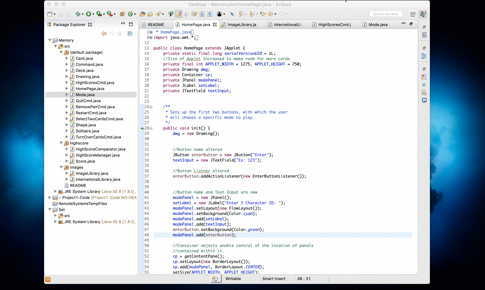

# memory-card-game
Using the system from Project 2 (set-gard-game) as a starting point, create a new applet that plays Memory.

Memory is normally played as follows:

1. There are 72 playing cards. They all have the same back and have a picture on the front. There are 2 cards 
with each of 36 pictures (that is, 36 pairs within the 72 cards).
2. Cards are usually put out on the playing field in 9 rows of 8 cards.
3. A turn consists of a player turning over 2 cards. If the cards have the same picture then the player removes 
that pair from the field of play and takes another turn. If the cards have different pictures then the player 
turns them back over (face down) and the next player takes a turn.
4. The game ends when there are no cards on the playing field. The player with the most pairs wins.

Project Description:

My version of Memory will unfold as follows:
1. At the start of the applet, the user provides a 3 letter user ID to the system. This will be used to store 
the player's score (number of turns it took it took them to clear the playing field) for each game that player plays. 
Note that this data is persistent! It must be stored in a file that is read from and written to by your program.
2. The XX playing cards will be laid out, face down. A counter for total number of turns shows	and is initially 0. 
A counter for pairs found shows and is initially 0.
3. Play unfolds as follows:

    3a. The player will click on two cards.
    
    3b. The cards turn over and the "turn counter" increases by 1.
    
    3c. If the cards form a pair (same image), then the user clicks a "Remove Pair" button which causes the two cards 
    to be removed from the playing field and the pair counter to increase by 1 (the system must verify that the two cards 
    really are a pair). If the cards do not form a pair, then the user clicks a "Turn Over Cards" button which causes the 
    two cards to turn face down (the system must verify that the two cards really are not a pair).
    
    3d. The player clicks on another two cards and play continues.
4. When the last pair is removed from the playing field, all of the user's scores, including for this newest game, are displayed (or just the top 10 if there are more than that).
5. The user is given the option to play again or quit.
